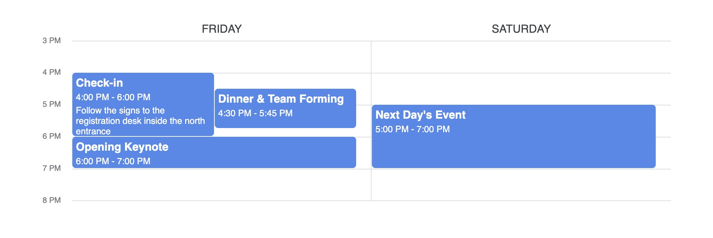
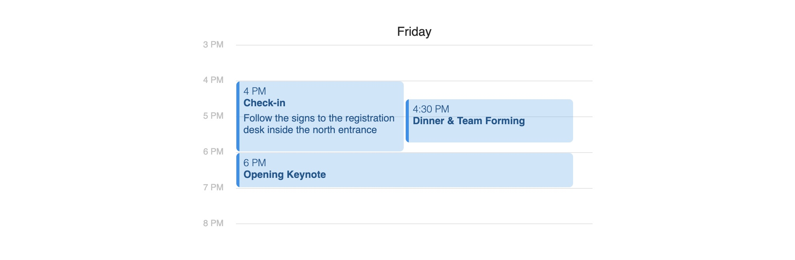

# React Schedule View

React Schedule View is a zero-dependency, fully customizable component for displaying schedules in a daily or week format.


## Install

React Schedule View is compatible with React versions 17 and 18.

```bash
npm i react-schedule-view
```

## Basic Usage

```typescript
const data: DaySchedule[] = [
  {
    name: "Friday",
    events: [
      {
        startTime: 16,
        endTime: 18,
        title: "Check-in",
        description:
          "Follow the signs to the registration desk inside the north entrance",
      },
      {
        startTime: 16.5,
        endTime: 17.75,
        title: "Dinner & Team Forming",
      },
      {
        startTime: 18,
        endTime: 19,
        title: "Opening Keynote",
      },
    ],
  },
  {
    name: "Saturday",
    events: [
      {
        startTime: 17,
        endTime: 19,
        title: "Next Day's Event",
      },
    ],
  },
];
```

```tsx
<ScheduleView daySchedules={data} viewStartTime={15} viewEndTime={20} />
```



## Alternate Theme

To change the calendar theme, you can pass a `theme` prop to the `ScheduleView` component. The theme can be a string `"apple"` or `"google"` (default), or a custom `CalendarTheme` object.

```tsx
<ScheduleView theme="apple" ... />
```



## Custom Tile Colors

Colors for each tile can be optionally given in the day schedule event data. If no color is given, the theme's default color (blue) will be used. This package includes both Apple and Google colors that can be used, but you can also use any CSS color value (RGB, HEX, color name, etc.).

```typescript
const data3: DaySchedule[] = [
  {
    name: "Custom Colors",
    events: [
      {
        startTime: 16,
        endTime: 18,
        title: "Theme Color",
        color: colors.apple.red,
      },
      {
        startTime: 16.5,
        endTime: 17.75,
        title: "RGB Color",
        color: "rgb(255, 0, 255)",
      },
      {
        startTime: 18,
        endTime: 19,
        title: "CSS Color Name",
        color: "royalblue",
      },
    ],
  },
];
```


## Complete Documentation

View the complete documentation at [https://despaintroy.github.io/react-schedule-view/](https://despaintroy.github.io/react-schedule-view/)
