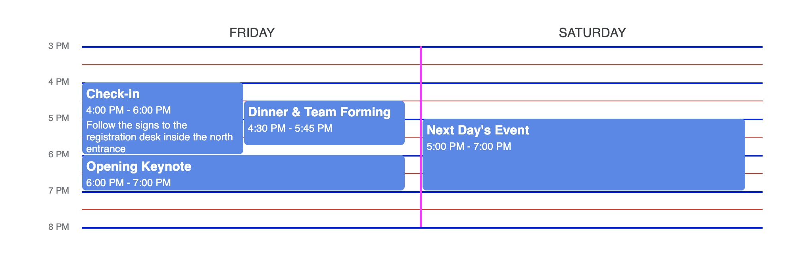

# Grid Lines

Grid lines' style are customized through the `style` prop, and the number of minor gridlines is set by the `minorGridlinesPerHour` prop. When setting the style of a gridline, pass a value for for the `border-style` css attribute.

```ts
const customTheme = createTheme("google", {
  minorGridlinesPerHour: 2,
  style: {
    minorGridlinesBorder: "1px solid red",
    majorGridlinesBorder: "2px solid blue",
    verticalGridlinesBorder: "3px solid magenta",
  },
})

...

<ScheduleView
  theme={customTheme}
  daySchedules={data}
  viewStartTime={15}
  viewEndTime={20}
/>
```


