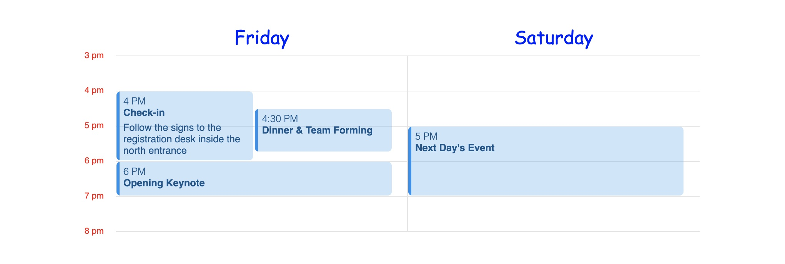

# Labels

The styles of day labels and time scale labels are customized through the `style` prop.

```typescript
const customTheme = createTheme("apple", {
  style: {
    dayLabels: {
      fontFamily: 'Comic Sans MS, Comic Sans',
      color: 'blue',
      fontSize: '1.5rem',
    },
    timeScaleLabels: {
      color: 'red',
      textTransform: 'lowercase',
    },
  },
})

...

<ScheduleView theme={customTheme} ... />
```


