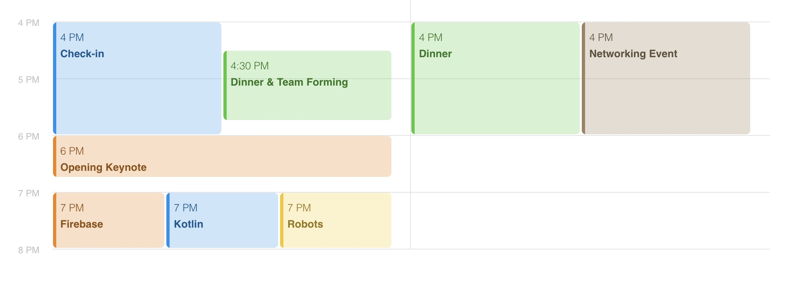
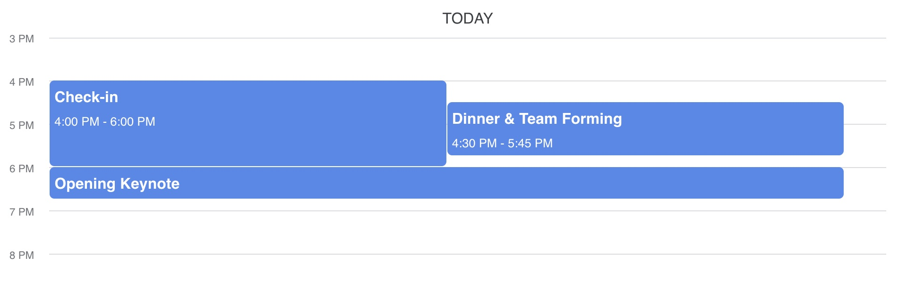

# Quick Start

React Schedule View is a zero-dependency, fully customizable component for displaying schedules in a daily or week format.

This package is currently under development and should not be used until a 1.0 version is published.



## Install

React Schedule View is compatible with React versions 17 and 18.

```bash
npm i react-schedule-view
```

## Example Usage

```typescript
const data: DaySchedule[] = [
  {
    name: "Today",
    events: [
      {
        startTime: 16,
        endTime: 18,
        title: "Check-in",
      },
      {
        startTime: 16.5,
        endTime: 17.75,
        title: "Dinner & Team Forming",
      },
      {
        startTime: 18,
        endTime: 18.75,
        title: "Opening Keynote",
      },
    ],
  },
];
```

```tsx
<ScheduleView daySchedules={data} viewStartTime={15} viewEndTime={20} />
```



## Schedule Data Format

### DaySchedule

| Property | Type                   | Description            |
| -------- | ---------------------- | ---------------------- |
| `name`   | `string`               | Name of the day        |
| `events` | `Array<CalendarEvent>` | Array of CalendarEvent |

### CalendarEvent

| Property      | Type      | Description                            |
| ------------- | --------- | -------------------------------------- |
| `startTime`   | `number`  | Start time of the event                |
| `endTime`     | `number`  | End time of the event                  |
| `title`       | `string`  | Title of the event                     |
| `description` | `string?` | Description of the event               |
| `color`       | `string?` | Color of the event tile as a CSS color |
